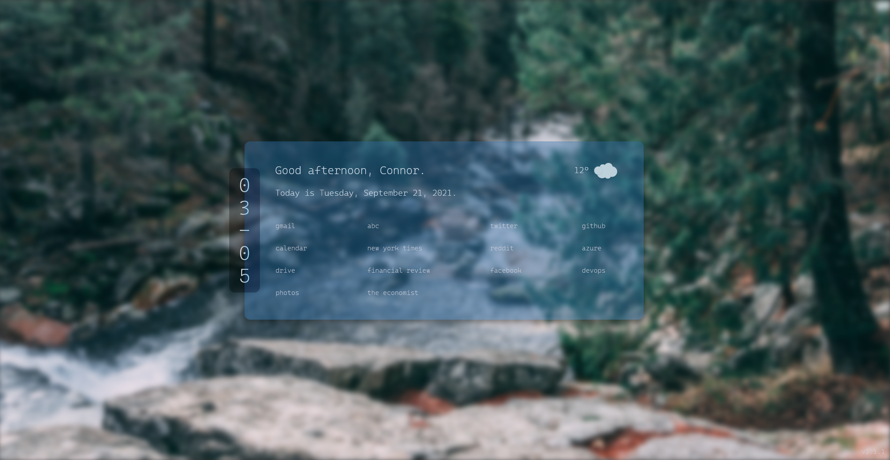

# Startpage

A simple startpage made with Svelte, Unsplash and Openweathermap API.



## Using this startpage

1. Download or clone the repository.
```
git clone https://github.com/Conr86/startpage
```

2. Install dependencies.
```
npm i
```
3. Replace the default bookmarks in `src/main.js` with your favourite sites.

4. To display your name and weather, go to `src/main.js` and change the variables. You will need an api key from https://openweathermap.org/ for the weather to work.

5. Build.
```
npm run build
```

6. If you are using Chrome or Edge, click "Load Unpacked" in the Extensions settings (It is an icon in Edge) and then select the `public` folder. You are finished!

7. If you are using Firefox, enter the `public` folder. Then sign the extension with an api key and api secret from https://addons.mozilla.org/developers/addon/api/key/.
```
cd public
web-ext sign --api-key=$API_KEY --api-secret=$API_SECRET
```

8. After signing is finished, you should see a folder called `web-ext-artifacts` with a `.xpi` file inside. Go to the Extensions settings in Firefox, click "Install Add-on From File...", and select the `.xpi` file.


## Credits

Heavily based on https://github.com/refact0r/startpage by @refact0r